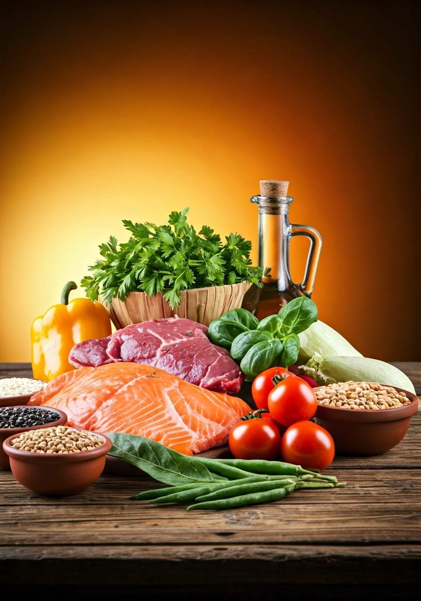

# Projeto EBOOK Gerado por I.A.s

    

 > Este é o repositório desenvolvido durante o curso no qual fui instrutor técnico na plataforma da [DIO](https://dio.me)

 > Bootcamp Santander 2024 - Fundamentos de IA para Devs - [LINK](https://app.santanderopenacademy.com/pt-BR/program/santander-bootcamp-2024)
-------

Projeto com o objetivo de gerar um ebook digital com as facilidades das ferramentas de IA. todos os prompts
seguem abaixo.

<a href="./output/Maneiras-de-ter-uma-boa-alimentacao-e-praticidade.pdf" title="View PDF now"> 📕Clique aqui para ler</a>

## 💻 Tecnologias utilizadas no projeto

- [Gamma](https://gamma.app/)

## 🧠 Prompts

|   Ação   | prompt                                                                                                                                                                                                                                                                         |
| :------: | ------------------------------------------------------------------------------------------------------------------------------------------------------------------------------------------------------------------------------------------------------------------------------ |
| Instrução | Prompt um guia passo a passo para utilizar inteligência artificial criando prompts assertivos seguindo o modelo de perguntas {FTAE} = FUNÇÃO, TIPO DE TEXTO, ASSUNTO E ESTILO|
|  título  | Crie um título de um ebook sobre o tema de alimentação rápida e prática, o ebook é do nicho de alimentos, o título deve ser simples e claro. Deve ter exemplo de refeição para semana, técnicas básicas de culinária, organização nas compras e armazenamento, receitas práticas  e rápidas e algumas sobremesas fáceis                                                      |
| conteúdo | Faça um texto para ebook , com foco em CSS, listando os principais seletores CSS com exemplos em código {REGRAS} Explique sempre de uma maneira simples Deixe o texto enxuto, Sempre traga exemplos de código em contextos reais , sempre deixe um título sugestivo por tópico |

## ✨ Features

- Conteúdo e imagens gerados via Gamma.app

## 📚 Materiais

- Imagens utilizadas em `assets`
- ebook gerado durante as aulas em `output`

## 🛠️ Instruções de execução

Utilize os prompts acima nas ferramentas sugeridas para gerar o material base e utilize uma ferramenta de edição de documentos como power point, libreoffice , indesign para diagramação.

## 👨‍💻 Expert

    
    
&nbsp&nbsp&nbspGeovanna Barros 
    &nbsp&nbsp&nbsp
    <a href="https://github.com/Geeobarros">
    GitHub</a>&nbsp;|&nbsp;
    <a href="https://www.linkedin.com/in/geovanna-barros-601032175
felipe-exe">LinkedIn</a>

   
    

  

---

⌨️ com 💜 por [Geovanna Barros](https://github.com/Geeobarros)